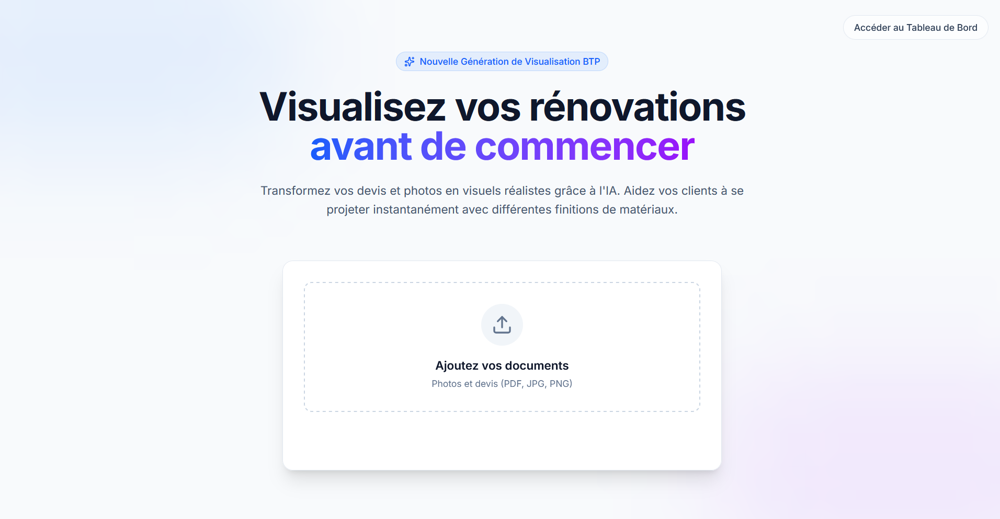
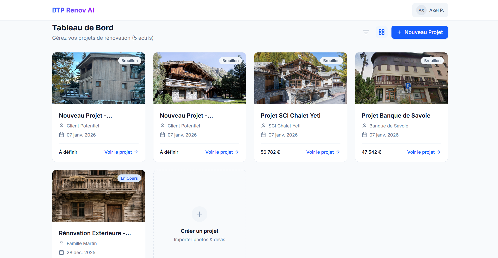
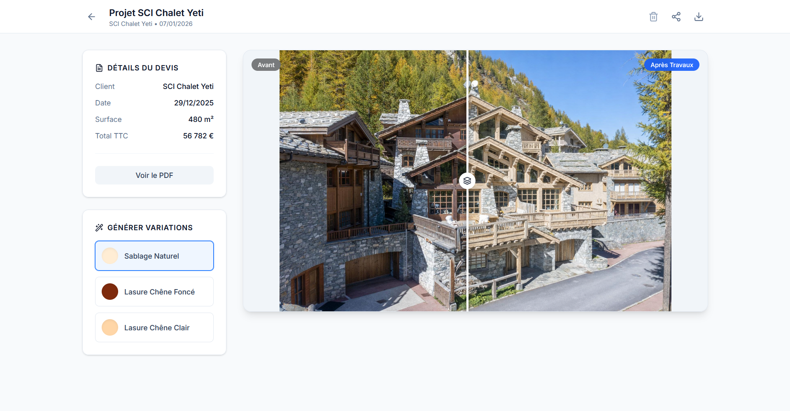

# AI Renovation Visualizer

**Live Demo:** [btp-ai-renov.vercel.app](https://btp-ai-renov.vercel.app/)

> ⚠️ **The demo is password-protected** due to API generation costs.
> Feel free to reach out to me directly to request a live demonstration.

## Screenshots

> The captures below illustrate the main interfaces of the application.

### Upload Menu


### Project Dashboard


### AI Visual Comparaison



## 1. Project Overview

This repository contains **BTP-AI-Renov**, a full-stack web application designed to bridge the gap between architectural quotations (devis) and visual rendering. By leveraging Generative AI and Large Language Models, the application allows users to upload raw PDF construction or renovation quotes and automatically generates high-fidelity visual previews of the proposed work.

The project is built with a modern React meta-framework and serverless architecture to ensure high performance, scalability, and seamless user experience from PDF parsing to image generation.

## 2. Core Features

- **Automated PDF Parsing:** Extracts technical specifications, material descriptions, and structural changes directly from uploaded PDF quotation documents.
- **AI-Powered Image Generation:** Utilizes **GPT-Image-1.5/edit** (via Fal.ai) to translate textual renovation instructions into photorealistic renders. This specific model was chosen because it generates high-fidelity images with strong prompt adherence, preserving the original composition, lighting, and fine-grained structural details.
- **Secure Authentication & Storage:** End-to-end user authentication and cloud blob storage for sensitive documents and visual assets, powered by **Supabase**.

## 3. Technical Architecture

The application is built on a robust, type-safe stack:

- **Frontend & Framework:** Next.js (App Router), React 19, Tailwind CSS v4, Framer Motion
- **Backend (API Routes):** Node.js (Next.js Server Actions & API Handlers)
- **Database, Auth & Cloud Storage:** PostgreSQL, Supabase Auth, and Supabase Storage
- **AI/ML Integrations:** GPT-Image-1.5/edit (via `@fal-ai/client`), LLM parsing
- **Deployment & Hosting:** Vercel (Edge Functions & Serverless)

### Directory Structure (Key Components)

- `src/app/api/`: Serverless endpoints for authentication, PDF parsing, project CRUD limits, and file uploads.
- `src/app/project/`: Dynamic routing for individual renovation projects and visualizer interfaces.
- `src/app/dashboard/`: Authenticated user area for global project management.
- `prisma/`: Database schema definitions and migration configurations.

## 4. Installation and Local Development

### Prerequisites
- Node.js (v20+)
- Postgres Database (Local or Supabase)
- API Keys: Supabase (URL & Anon Key), Fal.ai API Key.

### Environment Setup

1. **Clone the repository:**
   ```bash
   git clone https://github.com/axelClement/BTP-AI-Renov.git
   cd BTP-AI-Renov
   ```

2. **Install dependencies:**
   ```bash
   npm install
   ```

3. **Configure Environment Variables:**
   Create a `.env` file in the root directory and populate it with your specific credentials:
   ```env
   DATABASE_URL="postgres://[user]:[password]@[host]:[port]/[db]"
   NEXT_PUBLIC_SUPABASE_URL="https://your-project.supabase.co"
   NEXT_PUBLIC_SUPABASE_ANON_KEY="your-anon-key"
   FAL_KEY="your-fal-ai-key"
   ```

4. **Initialize the Database:**
   Deploy the Prisma schema to your PostgreSQL instance and generate the local client:
   ```bash
   npx prisma generate
   npx prisma db push
   ```

5. **Start the Development Server:**
   ```bash
   npm run dev
   ```
   The application will be accessible at [http://localhost:3000](http://localhost:3000).

## 5. Deployment

The application is fully optimized for edge runtimes and serverless environments. It is currently deployed via **Vercel**, ensuring high availability, fast asset delivery, and secure injection of environment variables.
